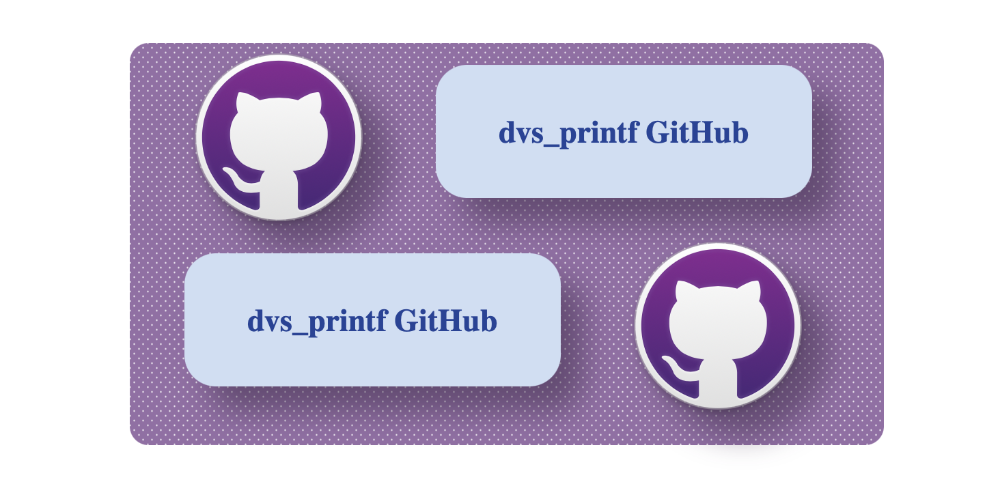

# Dvs_Printf

<div align="center">
<h3>Simple & Dynamic console animation styles for python</h3>
    
[](https://badge.fury.io/py/dvs-printf)
[](https://github.com/dhruvan-vyas/dvs_printf/actions)
[](https://github.com/dhruvan-vyas/dvs_printf/releases/tag/v1.3)<br>

[](https://github.com/dhruvan-vyas/dvs_printf/blob/main/LICENSE)
[](https://www.python.org/dev/peps/pep-0008/) 
</div> 

<!--  -->



 
enhance way to handle console output for Python projects. 
The module offers `printf` style animation functions that designed to enhance the 
visual appearance of terminal-based Python projects,
Key features include different animation styles, customizable speeds, and flexible formatting options. 


https://github.com/dhruvan-vyas/test_try/assets/98950841/556aa4a3-c280-4085-82b0-dadcad283f3c


https://github.com/dhruvan-vyas/test_try/assets/98950841/06fc32f5-717d-4606-81b3-b5d73bce6cf9


dvs_printf module include 3 main function and 1 sub function
* *[printf](#printf-function)* (core of the module)
* *[init](#dvs_printfinit-method)* (dynamic initializer for `printf`)
* *[showLoding](#showloding-function)* (creates loding bar)
* *[list_of_str](#any-to-list)* (Supplementary function)


Use Cases:

* `Liven up user interaction`: 
    The module can make console applications more engaging by adding visual effects during data printing. <br>
* `Progress visualization`: 
    Use styles like loading bars to indicate progress during long-running operations.<br>
* `Data presentation`: 
    Highlight key information within console output using eye-catching animation styles.<br>
* `Debugging and monitoring`:
    Animate data changes to aid in debugging and monitoring processes. <br>

---
<br>


https://github.com/dhruvan-vyas/test_try/assets/98950841/29608aee-0f1a-413b-bc19-858af6b612fe


# installation 
choose one liner command according to your system. <br>
Ensure that `pip` & `git` is installed and working on your system.

#### **Linux / MacOS**
```bash
pip3 install dvs_printf 
```
```bash
python3 -m pip install dvs_printf
```

#### **Windows** 

```bash
pip install dvs_printf
```
```bash
python -m pip install dvs_printf
```

#### **Clone the repository**
```bash
git clone https://github.com/dhruvan-vyas/test_dvs_printf.git
```

---

<br>

# printf function 

The printf function allow users to apply various animation styles to their values. 
Supports different data types ***(string, int, float, list, set, tuple, dict)*** and 
classes ***(numpy, tensorflow, pytorch, pandas)*** as input. 
Users can choose from a range of animation styles, including typing, headlines, Center,Left,right and more. 
Customizable parameters include style, speed, interval, getmat, stay. 

```python
from dvs_printf import printf

printf(values, style='typing', speed=3, interval=1, stay=True, getmat=False) # defaults
```

### values
values stream can be anything like
`(string, int, float, list, set, tuple, dict)`
and you can give multiple input as any-data-type.
animation workd separately for each element given, 
and for each item in given iterable.

```python              
printf(any, str, list, [tuple, set], dict, int, float,...)
```     

### style

Example Video==>


style defins different types of console output animation.<br>
each style type works differently according to the description below
``` python
style: ["typing", "async", "headline", "newsline", "mid", "gunshort", "snip", 
    "left", "right", "center", "centerAC", "centerAL", "centerAR", "Fire", 
    "wave", "Blink", "Scatter", "matrix", "matrix2", "f2b", "b2f", "help"]
``` 
``` python
printf(values, style="center")
``` 

| |  option  |                 description                  |
|-| -------- | -------------------------------------------- |
|*| typing   | print like typing animation (Default)        |
|*| *[Async](#async-style)* | print multiple lines simultaneously |
| | headline | print like head lines in news                |
| | newsline | print running newslines animation            |
| | mid      | print line from mid                          |
|*| left     | value coming from left side of the terminal  |
|*| right    | value coming from right side of the terminal |
|*| center   | animation appear at center of the terminal   |
|*| centerAC | values arrang at center of the terminal      |
|*| centerAL | arrang each-item at center-Left on terminal  |
|*| centerAR | arrang each-item at center-Right on terminal |
| | gunshort | firing the letters from short gun            |
| | snip     | sniping the letters from end of the terminal |
| | matrix   | print random letters to real line            |
| | matrix2  | print 1st letter and 2nd random letters      |
| | Scatter  | Scattered latters effect for each line       |
| | Fire     | appear latters with gap creates flame effect |
| | wave     | creates wave effect with each line.          | 
| | Blink    | appear Blink effect from start to end.       |
| | f2b      | typing and remove letter from back to front  |
| | b2f      | typing and remove letter from front to back  |

#### ****async Style**** 


Introducing a novel printing 'style—async'. This style revolutionizes the way multiple lines are printed simultaneously, 
optimizing display in both spacious and constrained terminals.

<video autoplay="" loop="true" controls="">
<source type="video/mp4" src="async_demo.mov">
</video>

*Key Features:*
- *`Simultaneous Printing:`* Print multiple lines simultaneously when there's ample space in the terminal.
- *`Adaptive Display:`* Adjusts output to fit within the terminal space, ensuring all lines are visible, even in limited space.<br>
- *`'async <int>':`* Control the pace of printing using async-style commands. Prefix lines with style="async <num_lines>" 
    to specify the number of lines to be printed and wait before proceeding.

*How to Use:*
-   To introduce a delay before printing a set of lines from given values, Use the style="async <num_lines>".  
    OR Use style="async" for  each line in given values to be printed simultaneously, according to available space.   
    if there is no enough space in terminal for given values, then it's prints sets of values that fit in terminal 
  
*Example:*
```python
printf(
    value_5_Lines,  
    style="async"      # for each line given
) 
```
```python
printf(
    "This is line 1\nThis is line 2\nThis is line 3", 
    "This is line 4\nThis is line 5", 
    interval=1
    style="async 2",   # for print sets of "2" lines from given. Ex:[1-2, 3-4, 5]
) 
```    

Please note that the terms "async" in this context do not relate to the async-IO functions in   
Python, but rather follow a Async-style naming convention specific to the dvs_printf module.  

---
[async_demo.mov](https://github.com/dhruvan-vyas/test_try/assets/98950841/e6aea525-c2c4-4383-b66e-89c655d8f5ac)


### Speed
Speed defins printf's animation speed, `default speed is 3` you can set `speed from ( 1 to 6 or 7)`
each style's speed is littel difrent 

Example Video==>

* 1 = *Very Slow*
* 2 = *Slow*
* 3 = *Mediam* 
* 4 = *Mediam Fast*
* 5 = *Fast*
* 6 = *Very Fast*
* 7 = *Super Fast* (*for very long Text)

```python
printf("hello world", speed=2) 
```


### interval
interval is waiting time between printing 
of two lines (interval in second) <br>
`default interval is 1`, 
you can set interval from `0 to 5 or greater` 

``` python
printf("hello world", "hii, I am coder", interval=2)

# (with animation)
>>> hello world  
>>> # (wating time of interval time in second)
>>> hii, I am coder  
```


### stay
stay decides after style animation whether you want the `values on stream OR Not`.
stay can be True or False, `(default stay = True)`.
if you want to remove printed line. you can set `stay=False`. 
So, After style amimetion and interval time printed Line can be removes.<br>

but some of the style `take No action on stay`,<br>
whether it is `True OR False`. it works as it should be.<br>
Ex. `(typing, async, headline, newsline, f2b, b2f, matrix, matrix2)`

``` python 
printf("hello world", 
    style="left", 
    stay=False,  #------> it's remove printed line after 1.5 seconds
    interval=1.5 #---------------------------------------^^^
    )
``` 
``` python 
printf("hello world", 
    style="headline", #--------------------------▼
    stay=True  # stay is False by default for headline
    )
```  

### getmat
matrix data modifier works with `numpy, pytorch, tensorflo, pandas, list`, Default = False <br>
can set as `True, "true", "show"`. getmat parameter directly passing to the list_of_str 

more about getmat on [list_of_str](#list_of_str-function) function.

<!-- list_of_str-Function -->
<a href="#list_of_str-function" style="text-decoration:none">

list of str
</a> 


---

<br>


# dvs_printf.init Method

A dynamic initializer for printf that allows users to preset parameters for consistent usage.  
Priority order for settings parameters: printf's keywords > Setter Variables > dvs_printf.init's keywords > Defaults. <br>
more about on GitHub README.

`printf is inefficient to use for very-logn code.`
so you can `Use initializer for dvs_printf`, using `init method`
you can `preset all parameters` with setter Variable.

```python
import dvs_printf 

# inistilizer
pf = dvs_printf.init()
printf = pf.printf

# perametars
pf.set_style = "centerAL"
pf.set_speed = 4
pf.set_interval = 0
pf.set_stay = False

printf("hello world", "walcome to my project") 
```

*`dvs_printf.init`* is very dynamic function, 
you can `give defualt parameters in init` function
as well as in `printf function.`

```python
import dvs_printf 

pf = dvs_printf.init(style="right")       # last priority 
printf = pf.printf

pf.set_style = "matrix"                   # 2nd priority  
printf("hello world", style="headline")   # 1st priority 
printf("walcome to my project")           # in this case style = "matrix" 
```
it works same `for all parameters.`
the `init` function has the `same keyword and defaults` `as printf.`

as shown in this code-snippet we have `the dynamic init method`, 
we can `preset all parameters` and can be `change at any point` according to your needs. <br>

**priority of parameters**

<div align="center" style="color:rgb(175, 145, 223)">

**printf's keywords** *>* **setter Veriables** *>* **dvs_printf.init's keywords** *>* **the defaults**
</div>

`keywords inside printf` function has the most priority,
then `Setter Variables Ex. set_speed` has the second priority, and `keywords inside init` method has the third priority and
if NOT Any parameters Are give, it `works on default parameters` at Last priority.

      
---

<br>

# showLoding Function

```python
def showLoding(target: object,
    args: tuple | None = (),
    kwargs: dict | None = {},
    lodingText: str | None = "Loding",
    lodingChar: str | None = "#"
) -> int: # [0 | 1]
```
```
Loding[##################           ] %60  
```
create loding bar in terminal with `threading` for 
* `waiting time for downlod files` 
* `run Any other function and wait till finish`


keep in mind that this function `already using print function` 
 so your `target function do not print anything` while loding 
otherwish loding bar will not work properly. <br>
loding function works on threading module 
so, it's `take same input as threading module`.
 

### target
the target `object` or `function` to work in background.<br>
the `object should be callable.` keep in mind that `target is keyword argument` 
not positional argument. it shuold be given as `target=function` and `do not call if for now`

```python
from dvs_printf import showLoding

def check_internet():
    pass # Check for Interner Conection

showLoding(target=check_internet)
```

### args
the `positional arguments` that `target function taks` in `tuple`.
But if there is just one positional argument passing, add coma at the end, args=(1`,`) becouse `args should be Tuple`.
```python
def FuncInfo(a, b, c ):
    ...

showLoding(target=FuncInfo, args=(a,b,c))
```

### kwargs
`dictionary` of the `keyword arguments` that `target function taks.` <br>
`keywords in string` and `arguments in asked data-type.`

```     
                keyword 
                   |       argument 
showLoding(        |          |
target=funcInfo ,  |          |
                   ▼          ▼
       kwargs={ "number1":    10    , 
                "number2":   22.10  ,
                "name"   :  "coder" , } 
    )
```

### lodingText
text befor loding bar, you can change it according to you needs <br>
`default is "loding "`

```
    lodingText = "downloading files"
        ▼
Downloding files[##########                   ] %35 
```

### lodingChar
Character to see progressed loding bar, `any charector` you can use in str <br>
```
    lodingChar = "*"
downloading files[**********                   ] %35   

downloading files[$$$$$$$$$$$$$$$              ] %50

downloading files[------------------           ] %60   
```
---
<br>

# list_of_str Function
An additionl function which is used by printf function, creates -> list[str] with input values. 

```python
list_of_str(*values: any, getmet: bool | str | None = False ) -> list[str]
```


return list with each elements given. takes any DataType 
and gives `list[str]` with each elements by index. 
for `list, tuple, dict, set` break this kind of 
DataSet and add Them into a list by index.

### getmat
matrix data modifier for 
`numpy, pytorch, tensorflow, pandas, list` 
it breaks matrices in `rows by index` and convert
that in to list of string, list[str]. <br>

getmat can be set as `True | "true" | "show"`, `default getmat = False`. 
* `True` or `"true"` to modify copy of matrix data for animation,
it's just show values of matrix 
* `"show"` matrix values `with information`, `<class, shape, dtype>` 
* if `getmat is False` it's apply animation `as normal matrix output`

<br>

```note
it's cheke for truthy value (if getmat:)
So, "false" is True
```
<br>

```python
import tensorflow as tf
tf_array = tf.Variable([   # Example Variable (tf_array)
    [[1,1,1],               
     [2,2,2],
     [3,3,3]],
], dtype=tf.float32)


list_of_str(tf_array, getmat=False)  # The default
# output_list: 
[
    "<tf.Variable 'Variable:0' shape=(1, 3, 3) dtype=float32, numpy=",
    "array([[[1., 1., 1.],",
    "        [2., 2., 2.],",
    "        [3., 3., 3.]]], dtype=float32)>"
]


list_of_str(tf_array, getmat=True)   # True or "true"
# output_list: 
[
    '[1.0, 1.0, 1.0]', 
    '[2.0, 2.0, 2.0]', 
    '[3.0, 3.0, 3.0]'
] 

 
list_of_str(tf_array, getmat="show")   # "show"
# output_list: 
[
    '[1, 1, 1]', 
    '[2, 2, 2]', 
    '[3, 3, 3]', 
    "<class 'Tensorflow'",
    "dtype: 'float32' ",
    "shape: (1, 3, 3)>"
]
```
The Module automatically check the size of the window and adjust what it shows accordingly.
Some Visual elements like Long Line should shrink depending on how much space is available.


